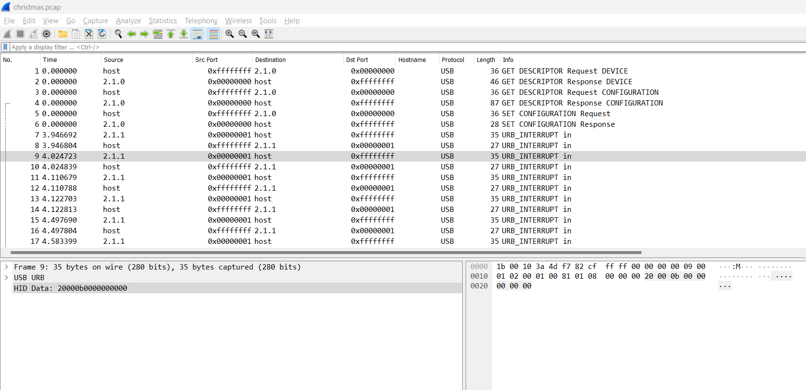
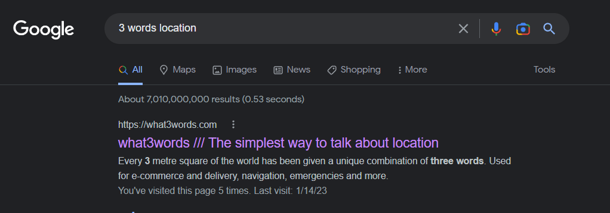
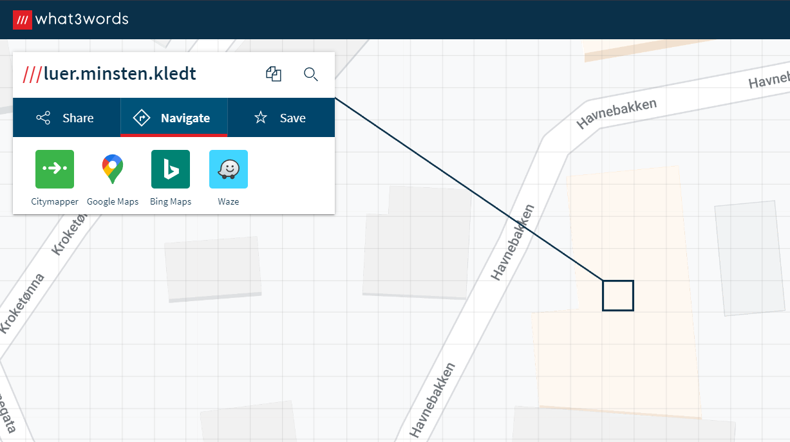
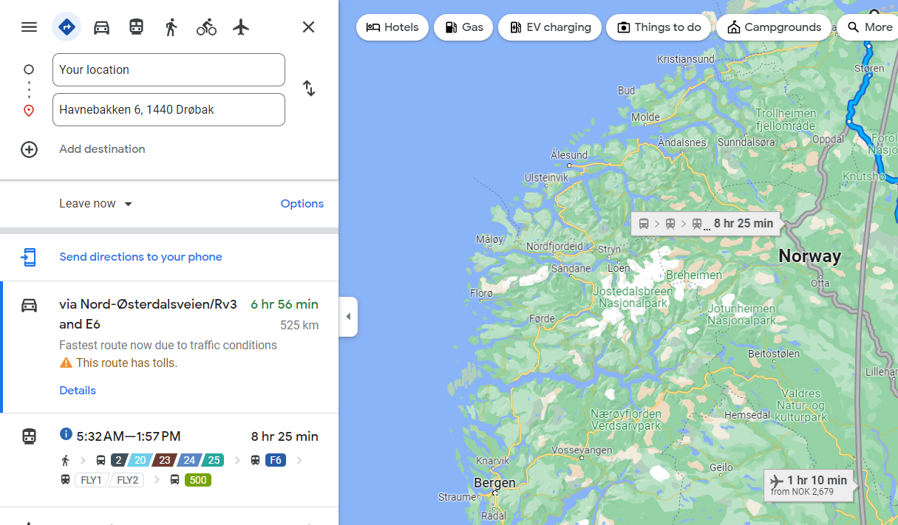

# Weeks:

- Week 1
- [Week 2](week2.md)
- [Week 3](week3.md)
- [Week 4](week4.md)

# Week 1 - normal

We are given a pcap file containing some USB traffic. And since the challenge hints at the use of nordic keyboards, we can guess that the USB traffic for a keyboard, which follows the HID protocol. Looking at the packets we can note some HID data in some of the packets. In this case `20000b0000000000` can be roughly translated as:

1. First byte (Modifier keys status): `0x20` -> `Right shift`
2. Second byte (Reserved field): `0x00` -> usually ignored
3. Third byte (Keypress #1): `0x0b` -> `h`

Resulting in the letter "H" in capital (due to shift being pressed).

> Read more on the HID protocol for keyboards here: https://wiki.osdev.org/USB_Human_Interface_Devices
>
> Furtheremore, a mapping of the different HID keys can be found here: https://gist.github.com/MightyPork/6da26e382a7ad91b5496ee55fdc73db2



From this, we can essentially parse the HID data for the different packets and then retrieve the keypresses!

Using tshark helps us do exactly that, but instead of creating our own script, we can find an usb keyboard parser online as shown below:

```
$ # Retrieve usb input data and format it according to how it is going to be parsed
$ tshark -r christmas.pcap -Y 'usb.capdata && usb.data_len == 8' -T fields -e usb.capdata | sed 's/../:&/g2' > keystrokes.txt

$ # Clone repository for parsing these data
$ git clone git@github.com:carlospolop-forks/ctf-usb-keyboard-parser.git
$ cd ctf-usb-keyboard-parser/

$ # Parse the usb keystrokes
$ python3 usbkeyboard.py ../keystrokes.txt
Hei juleen⌫⌫bn⌫⌫nissen!  F;lgende reinsdr⌫yr er klare til [rets tur>  Dasher, Dancer, Prac⌫ncer, Vixen, Comet, Cupid og Blitzen.
If;lge veterin'ralven har Rudolf f[tt en skadet klov. Det⌫⌫et vil derfor v're vanskelig for han [ lande p[ alle takene under levering av gavene.
Det skal jeg prsonlig s;rge for.
Stede⌫⌫⌫⌫⌫De 10 f;rste stedenee⌫ er som f;lger> Vads;, Hesseng, Vard;, Karasjok,  Rypefjord, Berlev[g, :ksfjord, Nordv[gen, Amtmannsnes, Lakselv. Jeg kommer tilbake til hvilket sted som er f;rst n[r kartavlene har f[tt kalkulert den beste ruten.
Slemmebarn listen best[r i [r av 20 barn. 5 B⌫barn er nye p[ listen mens de 15 siste er de samme som i fjor.
Det skal vi s;⌫elvf;lgelig s;rge fo⌫⌫⌫⌫ for.
Fikk akkuratt beskjed av kartavlene at rune⌫⌫ten er kalkulert, og f;rste sted duskal levere gaver til er Itemize&Berlev[g)
Avreise er 23. desember kl 23>49⌫⌫59.
```

The output we get, however, doesn't seem that right due to the script being made for the english/US keyboard layout. See modified solve script for week 1 [here](week1-solve.py):

```
Hei juleen⌫⌫bn⌫⌫nissen!  Følgende reinsdr⌫yr er klare til årets tur:  Dasher, Dancer, Prac⌫ncer, Vixen, Comet, Cupid og Blitzen.
Ifølge veterinæralven har Rudolf fått en skadet klov. Det⌫⌫et vil derfor være vanskelig for han å lande på alle takene under levering av gavene.
Det skal jeg prsonlig sørge for.
Stede⌫⌫⌫⌫⌫De 10 første stedenee⌫ er som følger: Vadsø, Hesseng, Vardø, Karasjok,  Rypefjord, Berlevåg, Øksfjord, Nordvågen, Amtmannsnes, Lakselv. Jeg kommer tilbake til hvilket sted som er først når kartavlene har fått kalkulert den beste ruten.
Slemmebarn listen består i år av 20 barn. 5 B⌫barn er nye på listen mens de 15 siste er de samme som i fjor.
Det skal vi sø⌫elvfølgelig sørge fo⌫⌫⌫⌫ for.
Fikk akkuratt beskjed av kartavlene at rune⌫⌫ten er kalkulert, og første sted duskal levere gaver til er Itemize{Berlevåg}
Avreise er 23. desember kl 23:49⌫⌫59.
```

### Flag

`Itemize{Berlevåg}`

# Week 1 - easy

We're given 3 words `luer.minsten.kledt` as our challenge which is supposedly a hint to a location. Knowing this, a quick google search shows a website that locates a location through 3 words called what3words.



Using the page of what3words with the 3 words https://what3words.com/luer.minsten.kledt gives us the location: `Havnebakken 6, 1440 Drøbak`.




### Flag

`Itemize{Havnebakken 6, 1440 Drøbak}`
