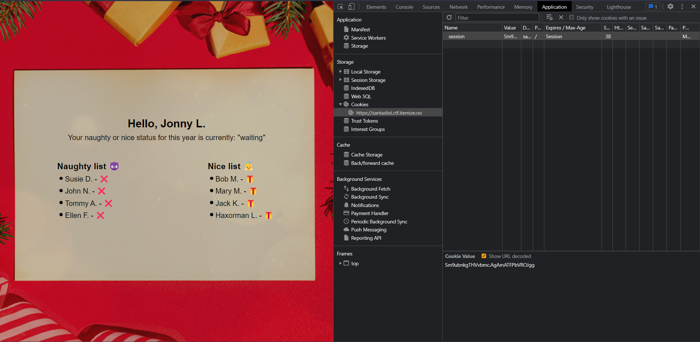

# Weeks:

- [Week 1](week1.md)
- Week 2
- [Week 3](week3.md)
- [Week 4](week4.md)

# Week 2 - normal

We're greeted with a website that let's us login through any name essentially giving us an early gift if we're found to be a nice child for the christmas. The mission is to steal the nice children's gifts. However, writing in the name of the already registered children gives us the error of `Child already claimed the gift`. We have to steal the gift with some other methods somehow.


Checking the `application` tab on devtools, shows us that a cookie is set when authenticating with a name. It seems to be a session cookie encoded with base64 and contains 2 parts divided by a punctuation character.



Decoding the session cookie does give us some essential information. The first part seems to be the name we are authenticated as, the data, while the other half of the cookie seemed to be some form of signature or verification data:


Modifying the signature in any way gives us the error: `Error: Session signature doesn't match the session data or name after XOR!`, which reveals that signature is generated through XOR on the inputted name. The problem here, however, is that XOR is vulnerable to known plaintext attacks since the reverse of XOR is XOR itself, just like what we have here in our case.

> Note:
>
> Sensitive information and data might be found and leaked through improper error handling, it is therefore sometimes wise to not display the errors as verbose as possible, but rather more vague to the users.

We can therefore retrieve the key by XORing the signature with the inputted name, giving us the signature key to be: `HoHoHo!!!`


With this, we have broken the signature and can thus essentially craft any session token as we want. Crafting a token for `Haxorman L337` and authenticating with the cookie `SGF4b3JtYW4gTDMzNw.AA4wADoCQE8BBFx7WA` will give us the flag:


### Flag

`Itemize{l33t_gr1nch3n_3r_t1lb4k3_1gj3n}`

# Week 2 - easy

We're given an encoded text message with the hint that `🎄= 0`. Checking the amount of. Since ASCII were hinted at in the challenge description, we can believe that the message should form numbers in the ASCII table range. With the number of emojis being 10, we can deduce that they can be mapped to decimals in the respective positions.

Doing so and parsing the emoji as decimals, and then parsing the numbers to ASCII should give us the flag. See solve script [here](week2-solve.py).

```
$ python3 week2-solve.py
073 116 101 109 105 122 101 123 115 051 110 100 049 110 103 095 102 048 114 115 049 110 107 051 116 125
Itemize{s3nd1ng_f0rs1nk3t}
```

### Flag

`Itemize{s3nd1ng_f0rs1nk3t}`
