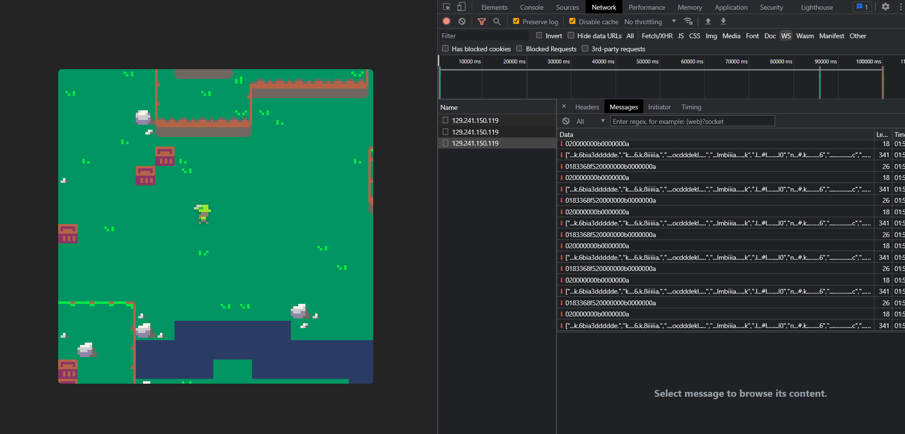

# Weeks:

- [Week 1](week1.md)
- [Week 2](week2.md)
- [Week 3](week3.md)
- Week 4

# Week 4 - normal

We're greeted with an online multiplayer tile-based game after navigating to the link http://129.241.150.119:34008/. From the challenge description, we can see that the flag is hidden across the river from where our player currently stands. The problem, however, is that there's no path that lets us cross the river in any way.

Looking at the source code, we can see that the javascript files are bundled and therefore obfuscated. Luckily for us, it is still quite readable and we can quickly notice that game is using websocket to communicate with the game server.

```
U(()=>{
        const c = new WebSocket("ws://129.241.150.119:34009");
        return e(c),
        ()=>c.close()
    }
```


Utilizing the network tab at devtools, we can filter out the messages of the websocket (WS) traffic and see the packets that is being sent and retrieved from and to the game server.



Moving our player sends the data `83368f520000000e0000000c`, and from moving around the map we can quickly see that the data is divided as such:

- `83368f52` - constant
- `0000000e` - x-position
- `0000000c` - y-position

Even though we can see from the source that the server is validating our player's movement server-side, it can be possible that there is no checks if the position changes drastically or not. Knowing this, we can test out to see if we're able to manipulate the data before being sent to the server with any number we want.

This could be done, by either modifying the source code, or we can simply set a debugpoint just right before sending the data packet, and then changing the data using the console-tab. Doing so lets us teleport the player over the river.


The flag can be retrieved by walking along the crates forming the flag.


> Note:
>
> Alternatively, one can set up a proxy using Burp Suite, and from there intercept, edit and forward or repeat the packet to the server as how we want.
> Creating a proxy is actually a popular technique used for some online games back in the days, and is still effective on some games today.

### Flag

`Itemize{l33t_h4x0r}`

# Week 4 - easy

Since this was a challenge released just some days before christmas, the difficulty were lowered by a lot. We're given a text that seemed to be morse code. One could then easily decode it by using [cyberchef](<https://gchq.github.io/CyberChef/#recipe=From_Morse_Code('Space','Line%20feed')ROT13(true,true,false,13)&input=LS0uLiAtLiAuLi4tIC0uLS0KLi0uLiAtLi4uIC4uLi4gLgouLS0tIC4uLi0gLi4tLiAuLi0gLS4tLSAuLi4tIC4uLS4gLS0uCi4uLSAuLS4gLiAuLS4gLS0tLi4uCi4tLSAuLi4uIC0uLS0gLi0uIC4tIC4uLi0gLi4tLiAuLi0uIC4tLiAuLSAuLS0uLS4gLi4uLSAtLS4gLi0uIC0tLi4gLi4uLSAtLSAuLS4gLi0uLS4tIC4tIC0uLi4>) using the magic function, which resulted in `morse`, then `rot13`.

This resulted in the message:

```
MAIL YOUR WISHLIST HERE: JULENISSEN@ITEMIZE.NO
```

Doing as what one is told, and mailing something to the e-mail: `julenissen@itemize.no` should give us the flag from an autoreply message.

### Flag

`Itemize{bekreftet_mottatt_ønskeliste}`
